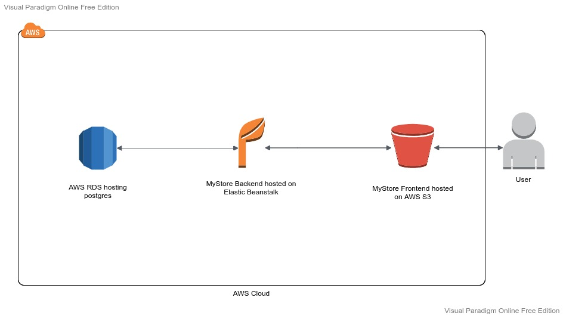

# Infrastructure

## AWS Services:

- **Database:**
    - Postgres Database hosted an AWS RDS
- **Backend:**
    - Built with Node.js and hosted on AWS Elastic Beanstalk
- **Frontend:**
    - Built with Angular and hosted on AWS S3

### Infrastructure Schema

