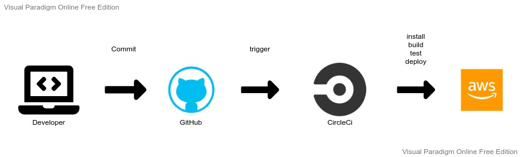

# Pipeline Process

CircleCi manages the pipeline with this connected GitHub repository

### Workflow:

- Install Front-End dependencies
- Install Back-End dependecies
- Build Front-End application
- Build Back-End application
- Run Front-End tests
- Run Back-End tests
- Deploy Front-End to AWS S3
- Deploy Back-End to AWS Elastic Beanstalk

